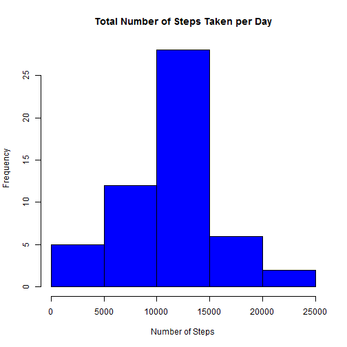
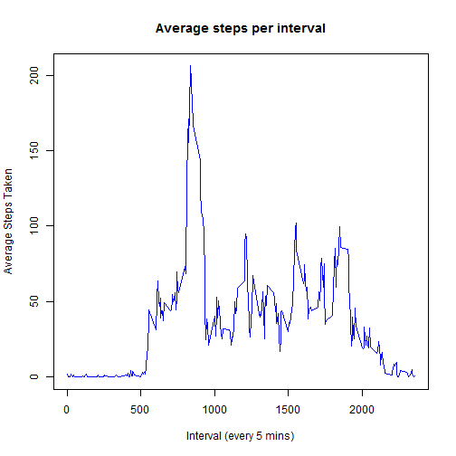

## Loading and Pre-processing the data.

Here I load the dataset.

```r
setwd("D:/Practice/R/")
#dataset
ds = read.csv("data/activity.csv", header=TRUE)
```

## What is mean total number of steps taken per day?

Here I am going to do the following:

1. Compute the total number of steps taken per day and display the result in a
histogram.
2. Calculate and report the mean and median total number of steps taken per day.


```r
ds2 = na.omit(ds)
ds2 = as.data.frame(ds2)
#group dataset by date and compute the sum of steps taken.
ds2.sum = aggregate(steps ~ date, data=ds2, sum)
#draw histogram
hist(ds2.sum$steps, col = "blue", main = "Total Number of Steps Taken per Day", 
                xlab = "Number of Steps")
```

 

```r
#Calculate and report the mean and median total number of steps taken per day.
ds2_mean = as.integer(mean(ds2.sum$steps))
ds2_median = median(ds2.sum$steps)
```

The mean of the total number of steps taken per day is **10766** and the 
median is **10765**.

## What is the daily acitivity pattern?

1. Make a time series plot (i.e. type = "l") of the 5-minute interval (x-axis) 
and the average number of steps taken, averaged across all days (y-axis)


```r
# group by interval and compute the average steps per interval.
ds2_int = aggregate(steps ~ interval, data = ds2, mean)

#plotting the time series graph
with(ds2_int, plot(interval, steps, main = "Average steps per interval", 
                   xlab="Interval (every 5 mins)", ylab= "Average Steps Taken", 
                   col = "blue", type = "l"))
```

 

2. Which 5-minute interval, on average across all the days in the dataset, contains the maximum number of steps?


```r
# group by interval and compute the average steps per interval.
ds2_sort = ds2_int[order(ds2_int$steps, decreasing = T),]

# obtaining the max number of steps.
options(digits=3)
ds2_max = ds2_sort[1,]
```

The maximum number of steps taken per interval is **206.17** and the 
interval is **835**.

## Imputing missing values

1. Calculate and report the total number of missing values in the dataset.


```r
na.obs = is.na(ds)
ds.na <- ds[na.obs,]
num_miss <- nrow(ds.na)
```

The number of missing values in the dataset is **2304**.

2. Devise a strategy for filling in all of the missing values in the dataset. 
The strategy does not need to be sophisticated. For example, you could use 
the mean/median for that day, or the mean for that 5-minute interval, etc.
Create a new dataset that is equal to the original dataset but with the 
missing data filled in.

To impute the missing values, I will replace the missing values with the mean
steps for that 5-minute interval.


```r
#ds2_int is a data frame that contains the average steps in each interval.
```
